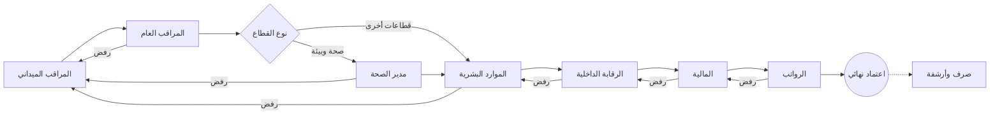

# 🦅 نظام تأييد الدوام الذكي (Smart Attendance Support System)


<div align="center">
  
</div>

<div dir="rtl">

## 🌟 نبذة عن النظام
نظام **تأييد الدوام الذكي** هو منصة مؤسسية متكاملة مصممة لإدارة عمليات الحضور والانصراف والرواتب لـ **مديرية الشؤون الصحية والبيئة**. يهدف النظام إلى أتمتة دورة حياة "تأييد الدوام" بالكامل، بدءاً من رصد المراقبين في الميدان، مروراً بسلسلة من الاعتمادات التدقيقية الصارمة، وصولاً إلى إصدار مسيرات الرواتب النهائية بدقة متناهية.

يتميز النظام ببنية تقنية صلبة وتصميم **Premium Vibrant** عصري يعتمد على تقنيات Glassmorphism لضمان تجربة مستخدم احترافية وعالية الكفاءة.

### ✨ المميزات الرئيسية المطورة
*   **🏗️ مسار اعتماد سباعي المراحل**: دورة عمل مؤتمتة تبدأ من الميدان وتنتهي في قسم الرواتب مع رقابة داخلية محكمة.
*   **🔄 دورة تصحيح ذكية (Smart Feedback Loop)**: نظام ملاحظات تفاعلي يسمح للمدققين برفض السجلات مع ذكر السبب، وإعادتها للمراقب للتصحيح الفوري.
*   **🌍 إدارة المناطق المتعددة (Multi-Area Support)**: [جديد] دعم كامل لإسناد مناطق متعددة للمستخدم الواحد مع تحويل ذكي لمعرفات المناطق لأسماء مفهومة في جميع الواجهات.
*   **⚡ أداء فائق وواجهات ديناميكية**: [جديد] تحسين سرعة التحميل عبر Dynamic Imports و Skeletons، مع نظام توجيه فوري (Instant Routing) للمستخدمين.
*   **🔍 رقابة داخلية متقدمة**: نظام تدقيق احترافي مع تصنيف المخاطر بناءً على مؤشرات إحصائية ذكية.
*   **💹 تتبع الميزانية الذكي**: مراقبة لحظية للإنفاق ونسبة استخدام الميزانية الشهرية في لوحة تحكم المالية.
*   **📊 تحليل التكاليف المتقدم**: تصنيف النفقات (عادي / إضافي / عطل / أعياد) مع مؤشرات مالية شاملة.
*   **🎨 تصميم Premium Vibrant**: واجهات مستخدم عالية التباين، ألوان حيوية، وتأثيرات زجاجية تعزز التركيز والوضوح.
*   **🛡️ أمان مستوى قاعدة البيانات (RLS)**: حماية البيانات في النواة عبر سياسات Row Level Security الصارمة.
*   **📜 سجل رقابة كامل (Audit Log)**: تتبع تفصيلي لكل عملية (إضافة، تعديل، حذف) مع واجهة مخصصة للإدارة.
*   **📥 تصدير البيانات الشامل**: دعم تصدير التقارير بصيغ CSV و Excel و PDF لجميع المستويات الإدارية.
*   **🖨️ تقارير مطبوعة رسمية**: كشوفات عرض ومسيرات رواتب مطابقة للمواصفات الحكومية بلمسة زر.

---

## 🏗️ البنية التقنية (Architecture)

تم تحديث النظام ليعتمد على أحدث إصدارات التقنيات مع هيكلية برمجية منظمة تضمن سهولة الصيانة والتوسع:

| التصنيف | التقنية | الإصدار | الغرض |
| :--- | :--- | :--- | :--- |
| **Framework** | [Next.js](https://nextjs.org/) | 16.0.10 (App Router) | إطار العمل الأساسي للواجهات والـ API |
| **React** | [React](https://react.dev/) | 19.2.1 | محرك تشغيل الواجهات وتدفق البيانات |
| **Language** | [TypeScript](https://www.typescriptlang.org/) | 5.0+ | لغة البرمجة لضمان Type Safety المركزي |
| **Styling** | [Tailwind CSS](https://tailwindcss.com/) | 4.x | تصميم الواجهات بنظام Utility-first المتطور |
| **Database** | [Supabase](https://supabase.com/) | PostgreSQL 15 | قاعدة البيانات، المصادقة، وإدارة الملفات |
| **Type System** | Centralized Definitions | `@/types` | نظام أنواع موحد يمنع التكرار والأخطاء الدائرية |
| **State Management** | Optimized Context | `AttendanceContext` | إدارة الحالة المركزية مع منطق ذكي لتوزيع القطاعات |

---

## 👥 مصفوفة الأدوار والصلاحيات (Role Matrix)

| الدور | الكود (Key) | المسؤوليات الرئيسية في النسخة المحدثة |
| :--- | :--- | :--- |
| **مدير النظام** | `admin` | التحكم المركزي، إدارة المستخدمين والعمال، التدقيق الشامل للسجلات (Audit). |
| **رئيس البلدية** | `mayor` | رؤية استراتيجية عبر Dashboards تلخص أداء القوى العاملة والالتزام العام ونسبة الإنجاز. |
| **مدير الصحة والبيئة** | `health_director` | مراقبة مؤشرات الأداء الصحية والبيئية، واعتماد كشوفات العمال في قطاع الصحة. |
| **الموارد البشرية** | `hr` | إدارة ملفات الموظفين، ضبط القطاعات الجغرافية، والتدقيق الإداري والقانوني. |
| **الرقابة الداخلية** | `internal_audit` | التدقيق الميداني، تصنيف المخاطر، مراجعة الأيام الإضافية، وضمان الامتثال والنزاهة. |
| **المالية والميزانية** | `finance` | التدقيق المالي، تتبع الميزانية، تحليل التكاليف، والاعتماد المالي النهائي. |
| **قسم الرواتب** | `payroll` | المرحلة النهائية: صرف المستحقات، إصدار مسيرات الرواتب الرسمية، والأرشفة المادية. |
| **المراقب العام** | `general_supervisor` | الإشراف الفني على المناطق الجغرافية، معالجة المناطق اليتيمة، ومراجعة عمل المراقبين. |
| **المراقب الميداني** | `supervisor` | الخط الأول: تسجيل الحضور اللحظي، معالجة النواقص، والتواصل المباشر مع العمال. |

---

## 🔄 دورة حياة الاعتماد الحية (7-Stage Workflow)



---

## 🚀 دليل التشغيل (Deployment)

```bash
# تثبيت التبعيات
npm install

# تشغيل بيئة التطوير
npm run dev

# بناء النسخة الإنتاجية
npm run build
```

---

## 📖 الدليل الإرشادي (User Guide)

للحصول على شرح تفصيلي لكيفية استخدام كل لوحة تحكم حسب دورك الوظيفي، يرجى الاطلاع على:

👉 **[دليل المستخدم الشامل (عرض ويب)](./docs/USER_GUIDE.md)** | **[تحميل نسخة PDF المباشرة 📥](./docs/USER_GUIDE.pdf)** 📚

---

## 🛡️ معايير النزاهة والأمان

تم تطبيق معايير **High-Level Security** لضمان عدم التلاعب بالسجلات:
1.  **Immutability**: سجلات الحضور المعتمدة نهائياً لا يمكن تعديلها إلا بصلاحيات Admin فائقة.
2.  **Concurrency Control**: منع التضارب عند اعتماد أكثر من مسؤول لنفس السجل في وقت واحد.
3.  **Real-time Audit**: يتم تدوين التغييرات فور حدوثها مع تسجيل هوية الفاعل والجهاز المستخدم.

---

<div align="center">

**تطوير وإشراف: فريق التحول الرقمي**  
**جميع الحقوق محفوظة لـ [abdoocoder](https://portfolio-abdoocoders-projects.vercel.app/)**

</div>

</div>
