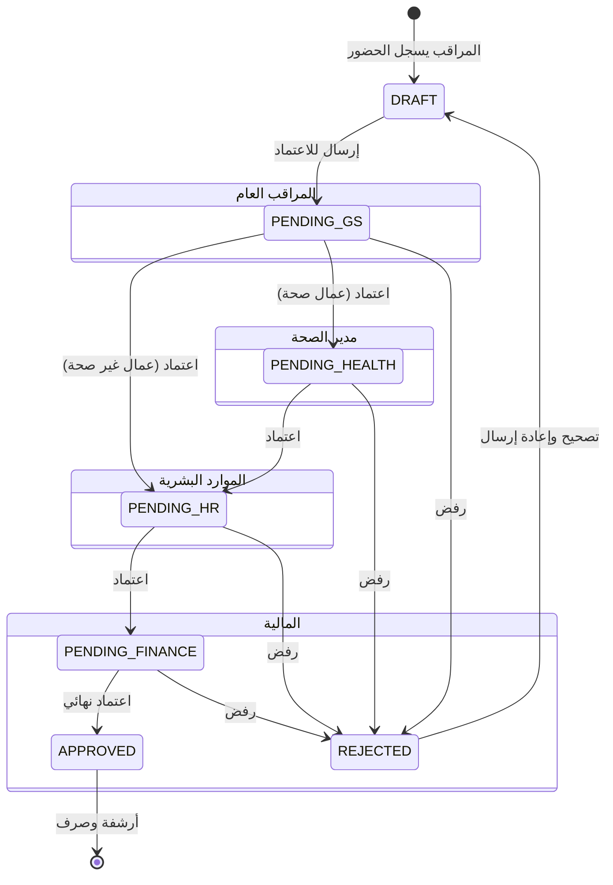

# 🦅 نظام تأييد الدوام الذكي (Smart Attendance Support System)


<div align="center">
  
</div>

<div dir="rtl">

## 🌟 نبذة عن النظام
نظام **تأييد الدوام الذكي** هو منصة مؤسسية متكاملة مصممة لإدارة عمليات الحضور والانصراف والرواتب للبلديات والمؤسسات الكبرى. يهدف النظام إلى أتمتة دورة حياة "تأييد الدوام" بالكامل، بدءاً من رصد المراقبين في الميدان، مروراً بسلسلة من الاعتمادات التدقيقية الصارمة، وصولاً إلى إصدار مسيرات الرواتب النهائية بدقة متناهية.

يتميز النظام ببنية تقنية صلبة تعتمد على أحدث تقنيات الويب، مع تركيز شديد على **أمن المعلومات**، **نزاهة البيانات**، و**تجربة المستخدم**.

### ✨ المميزات الرئيسية
*   **🏗️ مسار اعتماد خماسي المراحل**: من الميدان إلى الرواتب بلمسة واحدة.
*   **🛡️ أمان مستوى قاعدة البيانات (RLS)**: حماية البيانات في النواة وليس فقط في الواجهة.
*   **🌍 دعم تعدد المناطق المتقدم**: إسناد مسؤوليات متعددة لكل مسؤول بدقة.
*   **📊 واجهات ذكية (Glassmorphism)**: تجربة مستخدم عصرية وسلسة تحاكي الأنظمة العالمية.
*   **📜 سجل رقابة كامل (Audit Log)**: تتبع كل حركة في النظام بالثانية.
*   **🖨️ تقارير طباعة رسمية**: كشوفات جاهزة للاعتمادات الورقية والختم الرسمي.

---

## 🏗️ البنية التقنية (Architecture)

تم بناء النظام باستخدام "Modern Data Stack" لضمان الأداء العالي وقابلية التوسع:

| التصنيف | التقنية | الإصدار | الغرض |
| :--- | :--- | :--- | :--- |
| **Framework** | [Next.js](https://nextjs.org/) | 16 (App Router) | إطار العمل الأساسي للواجهات والـ API |
| **Language** | [TypeScript](https://www.typescriptlang.org/) | 5.0+ | لغة البرمجة لضمان Type Safety |
| **Styling** | [Tailwind CSS](https://tailwindcss.com/) | 4.0 | تصميم الواجهات بنظام Utility-first |
| **Database** | [Supabase](https://supabase.com/) | PostgreSQL 15 | قاعدة البيانات وإدارة المصادقة |
| **Security** | Row Level Security (RLS) | - | سياسات أمان على مستوى الصفوف في DB |
| **State** | React Context + Hooks | 19 | إدارة حالة التطبيق محلياً |

---

## 👥 مصفوفة الأدوار والصلاحيات (Role Matrix)

يتبنى النظام نموذج **RBAC (Role-Based Access Control)** صارم لضمان فصل المهام:

| الدور | الكود (Role Key) | المسؤوليات الرئيسية |
| :--- | :--- | :--- |
| **مدير النظام** | `admin` | إدارة المستخدمين، الاطلاع على كل السجلات، مراقبة سجلات النظام (Audit Log). |
| **الموارد البشرية** | `hr` | إدارة الموظفين، إدارة المناطق، الاعتماد النهائي قبل المالية (المرحلة 3). |
| **المالية** | `finance` | التدقيق المالي، الاعتماد النهائي، تصدير ملفات الرواتب (Excel/PDF). |
| **المراقب العام** | `general_supervisor` | الإشراف على مجموعة مناطق ومراقبين، الاعتماد الأولي (المرحلة 1). |
| **مدير الصحة** | `health_director` | اعتماد خاص لعمال القطاع الصحي (المرحلة 2 - مسار موازي). |
| **المراقب الميداني** | `supervisor` | تسجيل الحضور اليومي للعمال في مناطقه، معالجة السجلات المرفوضة. |
| **العميد** | `mayor` | لوحة تحكم قيادية (Dashboard) لعرض الإحصائيات والأداء العام. |

---

## 🔄 دورة حياة الاعتماد (Approval Workflow)

يخضع كل سجل حضور لسلسلة اعتمادات خماسية المراحل لضمان الدقة:



---

## 🛡️ الأمن والحماية (Security & Integrity)

### 1. Row Level Security (RLS)
لا تعتمد الحماية على الواجهات الأمامية فقط، بل هي محفورة في قاعدة البيانات.
*   **المراقب** يرى فقط عمال مناطقه.
*   **المراقب العام** يرى كل ما يقع تحت إشراف المراقبين التابعين له.
*   **المدراء** يرون البيانات حسب اختصاصهم الإداري.

### 2. سجل الرقابة (Audit System)
يتم تسجيل كل حركة في النظام في جدول `audit_logs` غير قابل للتعديل:
*   من قام بالتعديل؟
*   متى تم التعديل؟
*   ما هي القيمة القديمة والقيمة الجديدة؟
*   نوع العملية (INSERT, UPDATE, DELETE).

---

## 🚀 دليل التشغيل (Installation Guide)

### المتطلبات المسبقة
*   Node.js v20+
*   حساب Supabase نشط

### خطوات التثبيت

1.  **نسخ المستودع**:
    ```bash
    git clone https://github.com/your-org/tayid-aldawam.git
    cd tayid-aldawam
    ```

2.  **تثبيت الحزم**:
    ```bash
    npm install
    ```

3.  **إعداد متغيرات البيئة**:
    أنشئ ملف `.env.local` في المجلد الرئيسي:
    ```env
    NEXT_PUBLIC_SUPABASE_URL=YOUR_SUPABASE_URL
    NEXT_PUBLIC_SUPABASE_ANON_KEY=YOUR_SUPABASE_ANON_KEY
    ```

4.  **تشغيل التطبيق**:
    ```bash
    npm run dev
    ```

5.  ** بناء النسخة الإنتاجية**:
    ```bash
    npm run build
    npm start
    ```

---

## 📂 هيكلية المشروع (Project Structure)

```tree
src/
├── app/                 # (App Router) صفحات الموقع
│   ├── (auth)/         # صفحات تسجيل الدخول
│   ├── (dashboard)/    # لوحات التحكم المحمية
│   └── api/            # نقاط الاتصال الخلفية (Backend Routes)
├── components/          # مكتبة المكونات
│   ├── ui/             # مكونات التصميم الأساسية
│   └── views/          # واجهات المستخدم حسب الدور
├── context/            # إدارة الحالة (Global State)
├── lib/                # دوال مساعدة والاتصال بقاعدة البيانات
└── types/              # تعريفات TypeScript
```

</div>

---

<div dir="rtl">

## 📖 الدليل الإرشادي (User Guide)

### دليل المستخدم الشامل

للحصول على **دليل شامل ومفصل** لاستخدام النظام، يرجى الاطلاع على:

👉 **[دليل المستخدم الكامل](./docs/USER_GUIDE.md)** 📚

يحتوي الدليل على:

- ✅ **شرح تفصيلي لكل دور** من الأدوار السبعة
- ✅ **خطوات العمل خطوة بخطوة** مع أمثلة عملية
- ✅ **إرشادات الطباعة** وإعداد التقارير الرسمية
- ✅ **استكشاف الأخطاء والحلول** للمشاكل الشائعة
- ✅ **نصائح الاستخدام الأمثل** لكل دور
- ✅ **سير العمل الكامل** لدورة حياة السجل

### الأقسام الرئيسية

| القسم | الوصف |
| :--- | :--- |
| **البدء السريع** | تسجيل الدخول والواجهة الأساسية |
| **دليل الأدوار** | شرح تفصيلي لكل من الأدوار السبعة |
| **سير العمل** | دورة حياة السجل الكاملة من البداية للنهاية |
| **الطباعة والتقارير** | كيفية إعداد وطباعة التقارير الرسمية |
| **البحث والفلترة** | استخدام أدوات البحث المتقدمة |
| **حل المشاكل** | استكشاف الأخطاء الشائعة وحلولها |
| **الدعم الفني** | كيفية الحصول على المساعدة |

### استخدام الدليل

**للموظفين الجدد:**
- استخدمه كمادة تدريبية شاملة
- اقرأ القسم الخاص بدورك بالتفصيل
- اتبع الخطوات المرقمة بعناية

**كمرجع عملي:**
- ارجع إليه عند الحاجة
- استخدم جدول المحتويات للوصول السريع
- شاركه مع زملائك في الفريق

### التحميل والطباعة

يمكنك:
- قراءة الدليل مباشرة من الرابط
- طباعة الأقسام المطلوبة فقط
- تحويله إلى PDF للتوزيع

> **ملاحظة:** يتم تحديث الدليل باستمرار مع إضافة ميزات جديدة للنظام.

</div>

---

<div align="center">

**Developed with ❤️ by Digital Transformation Team**

</div>
