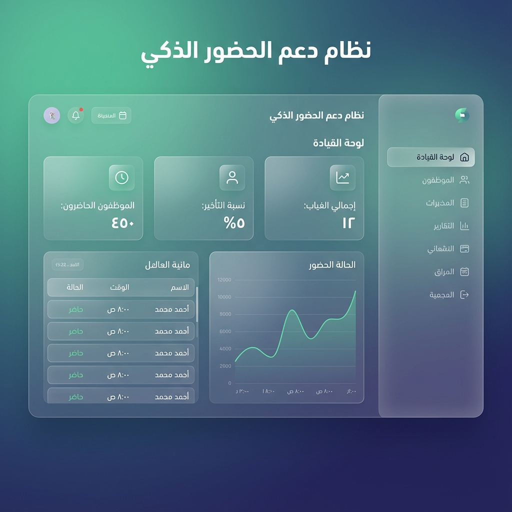
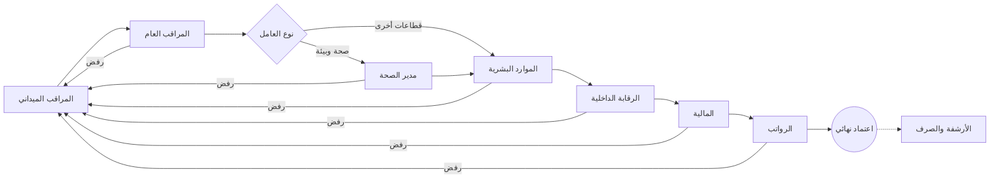

# 🦅 نظام تأييد الدوام الذكي (Smart Attendance Support System)


<div align="center">
  
</div>

<div dir="rtl">

## 🌟 نبذة عن النظام
نظام **تأييد الدوام الذكي** هو منصة مؤسسية متكاملة مصممة لإدارة عمليات الحضور والانصراف والرواتب لـ **مديرية الشؤون الصحية والبيئة**. يهدف النظام إلى أتمتة دورة حياة "تأييد الدوام" بالكامل، بدءاً من رصد المراقبين في الميدان، مروراً بسلسلة من الاعتمادات التدقيقية الصارمة، وصولاً إلى إصدار مسيرات الرواتب النهائية بدقة متناهية.

يتميز النظام ببنية تقنية صلبة وتصميم **Premium Vibrant** عصري يعتمد على تقنيات Glassmorphism لضمان تجربة مستخدم احترافية وعالية الكفاءة.

### ✨ المميزات الرئيسية المطورة
*   **🏗️ مسار اعتماد سباعي المراحل**: دورة عمل مؤتمتة تبدأ من الميدان وتنتهي في قسم الرواتب مع رقابة داخلية محكمة.
*   **🔍 رقابة داخلية متقدمة**: نظام تدقيق احترافي مع تصنيف المخاطر (منخفضة/متوسطة/عالية) وفلاتر ذكية.
*   **💹 تتبع الميزانية الذكي**: مراقبة لحظية للإنفاق ونسبة استخدام الميزانية الشهرية.
*   **📊 تحليل التكاليف المتقدم**: تصنيف النفقات (عادي / إضافي / عطل) مع مؤشرات مالية شاملة.
*   **🎨 تصميم Premium Vibrant**: واجهات مستخدم عالية التباين، ألوان حيوية، وتأثيرات زجاجية (Glassmorphism) تعزز التركيز والوضوح.
*   **🛡️ أمان مستوى قاعدة البيانات (RLS)**: حماية البيانات في النواة عبر سياسات Row Level Security الصارمة.
*   **🏢 الإدارة المركزية (Governance Hub)**: لوحة تحكم إدارية شاملة لإدارة المستخدمين، العمال، ومراقبة السجلات (Audit logs).
*   **📈 الرقابة البيئية والصحية**: مؤشرات أداء (KPIs) متخصصة لمديرية الصحة والبيئة.
*   **🔔 تتبع الأنشطة اللحظي**: قسم "Recently Approved" لمراقبة أحدث الاعتمادات فور حدوثها.
*   **📜 سجل رقابة كامل (Audit Log)**: تتبع تفصيلي لكل تعديل أو حذف في النظام لضمان الشفافية المطلقة.
*   **🖨️ تقارير ذكية**: كشوفات طباعة رسمية مطابقة للمواصفات الحكومية.

---

## 🏗️ البنية التقنية (Architecture)

تم تحديث النظام ليعتمد على أحدث إصدارات التقنيات لضمان السرعة والأمان:

| التصنيف | التقنية | الإصدار | الغرض |
| :--- | :--- | :--- | :--- |
| **Framework** | [Next.js](https://nextjs.org/) | 16.0.10 (App Router) | إطار العمل الأساسي للواجهات والـ API |
| **React** | [React](https://react.dev/) | 19.2.1 | محرك تشغيل الواجهات وتدفق البيانات |
| **Language** | [TypeScript](https://www.typescriptlang.org/) | 5.0+ | لغة البرمجة لضمان Type Safety |
| **Styling** | [Tailwind CSS](https://tailwindcss.com/) | 4.x (latest) | تصميم الواجهات بنظام Utility-first المتطور |
| **Database** | [Supabase](https://supabase.com/) | PostgreSQL 15 | قاعدة البيانات، المصادقة، وإدارة الملفات |
| **State** | Context API | - | إدارة حالة التطبيق محلياً وبث البيانات |

---

## 👥 مصفوفة الأدوار والصلاحيات (Role Matrix)

| الدور | الكود (Key) | المسؤوليات الرئيسية في النسخة المحدثة |
| :--- | :--- | :--- |
| **مدير النظام** | `admin` | التحكم المركزي، إدارة المستخدمين والعمال، التدقيق الشامل للسجلات (Audit). |
| **مدير الصحة والبيئة** | `health_director` | مراقبة مؤشرات الأداء الصحية والبيئية، واعتماد كشوفات العمال المتخصصين. |
| **الموارد البشرية** | `hr` | إدارة ملفات الموظفين، ضبط القطاعات الجغرافية، والتدقيق الإداري للمرحلة قبل النهائية. |
| **الرقابة الداخلية** | `internal_audit` | التدقيق الميداني، تصنيف المخاطر، مراجعة الأيام الإضافية، وضمان الامتثال قبل الاعتماد المالي. |
| **المالية والرواتب** | `finance` | التدقيق المالي، تتبع الميزانية، تحليل التكاليف، والتحويل لقسم الإصدار البنكي. |
| **المراقب العام** | `general_supervisor` | الإشراف الفني على المناطق الجغرافية، مراجعة عمل المراقبين الميدانيين. |
| **المراقب الميداني** | `supervisor` | الخط الأول: تسجيل الحضور اللحظي، معالجة النواقص، والتواصل مع العمال. |
| **رئيس البلدية** | `mayor` | رؤية استراتيجية عبر Dashboards تلخص أداء القوى العاملة والالتزام العام. |

---

## 🔄 دورة حياة الاعتماد (Approval Workflow)



---

## 🚀 دليل التشغيل (Deployment)

النظام مهيأ للنشر المباشر على منصات مثل **Vercel** أو **Netlify**:

```bash
# تثبيت التبعيات
npm install

# تشغيل بيئة التطوير
npm run dev

# بناء النسخة الإنتاجية
npm run build
```

---

## 📖 الدليل الإرشادي (User Guide)

للحصول على شرح تفصيلي لكيفية استخدام كل لوحة تحكم حسب دورك الوظيفي، يرجى الاطلاع على:

👉 **[دليل المستخدم الشامل (عرض ويب)](./docs/USER_GUIDE.md)** | **[تحميل نسخة PDF المباشرة 📥](./docs/USER_GUIDE.pdf)** 📚

---

## 🛡️ معايير النزاهة والأمان

تم تطبيق معايير **High-Level Security** لضمان عدم التلاعب بالسجلات:
1.  **Immutability**: سجلات الحضور المعتمدة نهائياً لا يمكن تعديلها إلا بصلاحيات Admin فائقة.
2.  **Concurrency Control**: منع التضارب عند اعتماد أكثر من مسؤول لنفس السجل في وقت واحد.
3.  **Real-time Audit**: يتم تدوين التغييرات فور حدوثها مع تسجيل هوية الفاعل والجهاز المستخدم.

---

<div align="center">

**تطوير وإشراف: فريق التحول الرقمي**  
**جميع الحقوق محفوظة لمديرية الشؤون الصحية والبيئة - 2025**

</div>

</div>
