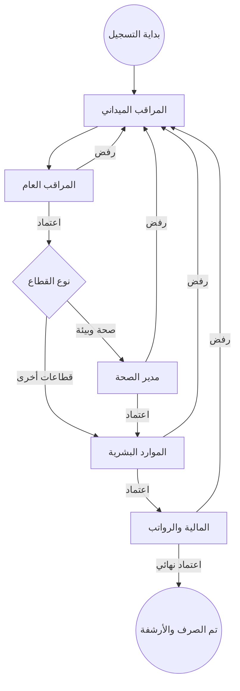

# 🦅 دليل المستخدم الشامل - نظام تأييد الدوام الذكي
### (Smart Attendance Support System - User Manual)

أهلاً بك في الدليل الإرشادي الرسمي والكامل لنظام تأييد الدوام الذكي. تم تصميم هذا الدليل ليكون مرجعك الأساسي في فهم كل جزئية في النظام، بدءاً من تسجيل الدخول وحتى إصدار التقارير النهائية.

---

### [📥 اضغط هنا لتحميل الدليل بصيغة PDF جاهزة للطباعة](./USER_GUIDE.pdf)

---

---

## 📑 فهرس المحتويات
1.  [الوصول للنظام (تسجيل الدخول)](#دخول)
2.  [المراقب الميداني (Supervisor) - تسجيل الحضور](#دليل-المراقب)
3.  [المراقب العام (General Supervisor) - التدقيق الأولي](#دليل-المراقب-العام)
4.  [مدير الصحة والبيئة (Health Director) - الاعتماد الفني](#دليل-مدير-الصحة)
5.  [الموارد البشرية (HR) - إدارة البيانات والتدقيق](#دليل-الموارد-البشرية)
6.  [المالية والرواتب (Finance) - التدقيق المالي والصرف](#دليل-المالية)
7.  [مدير النظام (Admin) - التحكم المركزي والرقابة](#دليل-المدير)
8.  [رئيس البلدية (Mayor) - التقارير الاستراتيجية](#دليل-الرئيس)
9.  [دورة حياة السجل (Workflow Diagram)](#دورة-الحياة)
10. [الأسئلة الشائعة والدعم التقني](#الدعم)

---

## 🔐 1. الوصول للنظام (تسجيل الدخول)

للدخول إلى النظام، يجب عليك استخدام البريد الإلكتروني وكلمة المرور الممنوحة لك من قبل مدير النظام.

*(واجهة تسجيل الدخول - أدخل بياناتك واضغط دخول)*

### خطوات الدخول:
1.  أدخل بريدك الإلكتروني (مثل: `mohammad@domain.com`).
2.  أدخل كلمة المرور الخاصة بك.
3.  اضغط على زر **"تسجيل الدخول"**.
4.  في حال كانت هذه المرة الأولى لك، قد يطلب منك النظام تحديث بياناتك الشخصية.

> [!IMPORTANT]
> حافظ على سرية كلمة المرور الخاصة بك، حيث أن كل عملية تتم في النظام تُسجل باسمك في "سجل الرقابة".

---

## 👷 2. المراقب الميداني (Supervisor)
بصفتك مراقباً ميدانياً، أنت المسؤول عن إدخال البيانات الخام للنظام.

### الإجراءات اليومية والواجهات:

1. **لوحة التحكم الميدانية**: تظهر لك ملخصاً لعدد العمال والقطاعات المسؤول عنها.

2. **تسجيل حضور عامل**: يمكنك البحث عن العامل وتسجيل حالته اليومية بسهولة.

3. **إدارة السجلات المرفوعة**: متابعة السجلات التي تم إرسالها وحالتها الحالية.

### إدارة السجلات المرفوضة:
إذا ظهر لك تنبيه باللون الأحمر، فهذا يعني أن هناك سجلاً تم رفضه من قبل الإدارة.
*   ادخل على "السجلات المرفوضة".
*   اقرأ ملاحظة الرفض (مثلاً: "خطأ في عدد الأيام").
*   قم بالتعديل واضغط "إعادة إرسال".

---

## 👨‍💼 3. المراقب العام (General Supervisor)
أنت حلقة الوصل بين الميدان والإدارة العليا، والمسؤول عن التدقيق الفني الأولي.

### واجهات التدقيق والاعتماد:

1. **إحصائيات القطاعات**: مراقبة الأداء العام لجميع المراقبين الميدانيين.

2. **تدقيق السجلات المرفوعة**: مراجعة تفصيلية قبل الاعتماد.

3. **لوحة التحكم المركزية**: متابعة سير العمليات وحالات الرفض والقبول.

---

## 🩺 4. مدير الصحة والبيئة (Health Director)
هذا الدور يركز على الكفاءة الفنية لقطاع الصحة والبيئة.

### المهام المتقدمة:
*   **مراقبة التوزيع**: تأكد من أن عدد العمال في كل حي كافٍ للاحتياجات البيئية.
*   **اعتماد السجلات**: مراجعة شاملة لسجلات قطاع الصحة قبل انتقالها للموارد البشرية.
*   **مؤشرات الأداء**: متابعة الرسوم البيانية لنسبة الحضور والغياب في القطاعات الصحية.

---

## 🏢 5. الموارد البشرية (HR)
أنت المتحكم في قاعدة بيانات العمال والهيكلية الإدارية.

### إدارة البيانات:
1.  **إضافة عامل جديد**: أدخل الرقم الوظيفي، الاسم، والحي التابع له، وقيمة اليومية.
2.  **توزيع العمال**: يمكنك نقل العامل من منطقة إلى أخرى بضغطة زر.
3.  **التدقيق الإداري**: مراجعة السجلات للتأكد من أنها تتماشى مع العقود والقوانين الإدارية.

---

## 💰 6. المالية والرواتب (Finance)
المرحلة النهائية والتدقيق المالي الأكثر أهمية.

*(لوحة تحكم المالية - تظهر إجماليات الرواتب والتدقيق المالي)*

### الإجراءات المالية:
1.  **مراجعة المستحقات**: يقوم النظام باحتساب الراتب آلياً (الأيام العادية + الإضافي).
2.  **التدقيق المالي**: مراجعة المبالغ قبل الصرف.
3.  **الاعتماد النهائي**: عند ضغط "اعتماد نهائي"، يتم تثبيت السجل مالياً.
4.  **الطباعة**: يمكنك طباعة "كشف عرض" أو "مسيرة رواتب" جاهزة للختم.

---

## 🛡️ 7. مدير النظام (Admin)
أعلى مستوى من الصلاحيات للإشراف العام والتحكم المركزي.

### التبويبات والواجهات الإدارية:

1.  **لوحة الإحصائيات (Overview)**: عرض ملخص سريع للمستخدمين والنشاط الأخير.
    
    *(نظرة عامة على نشاط النظام والمستخدمين المتواجدين حالياً)*

2.  **إدارة المستخدمين (Users)**: إضافة وتعديل صلاحيات الموظفين.
    
    *(واجهة التحكم في حسابات الموظفين وتعيين أدوارهم الوظيفية)*

3.  **إدارة العمال (Workers)**: قاعدة بيانات القوى العاملة بالأجور والقطاعات.
    
    *(إضافة وتعديل بيانات العمال وتنسيبهم للأحياء المختلفة)*

4.  **سجل الحضور والرواتب (Attendance)**: مراقبة حالة الرفع والتدقيق المالي.
    
    *(متابعة حالة اعتماد كشوفات الدوام والتأكد من سير العمل المالي)*

5.  **سجل الأنشطة (Logs)**: تتبع كل حركة في النظام بدقة.
    
    *(سجل الرقابة التقني الذي يوضح تفاصيل العمليات الحيوية)*

---

## 🦅 8. رئيس البلدية (Mayor)
لوحة معلومات قيادية مختصرة تدعم اتخاذ القرار.

*   **KPIs (مؤشرات الأداء)**: تظهر لك إجمالي الرواتب المصروفة، عدد القوى العاملة النشطة، والقطاعات الأكثر كفاءة.
*   **عرض فقط**: لا يمكن التعديل من هذه اللوحة، فهي مخصصة للرقابة العليا فقط.

---

## 🔄 9. دورة حياة السجل (Workflow)

الرسم التوضيحي التالي يبين كيف ينتقل السجل بين الإدارات:

---

## 🛠️ 10. الأسئلة الشائعة والدعم التقني

**س: لماذا لا استطيع تعديل سجل معين؟**
*   **ج**: ربما يكون السجل قد تم اعتماده نهائياً من قبل المالية. السجلات المعتمدة نهائياً تُقفل للحماية.

**س: العامل انتقل لحي آخر، كيف أغيره؟**
*   **ج**: قسم الموارد البشرية (HR) هو الوحيد المختول بتعديل بيانات العامل وتغيير منطقته.

**س: هل يعمل النظام على الهاتف المحمول؟**
*   **ج**: نعم، النظام مصمم ليكون متوافقاً تماماً مع جميع الأجهزة (Mobile, Tablet, Desktop).

---

  <h3>🦅 نظام تأييد الدوام الذكي</h3>
  
نحو تحول رقمي آمن وفعال

  
2025 © جميع الحقوق محفوظة

