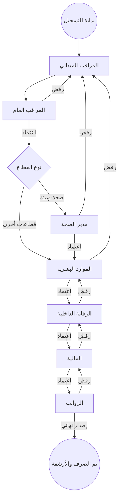

# 🦅 دليل المستخدم الشامل - نظام تأييد الدوام الذكي
### (Smart Attendance Support System - User Manual)

أهلاً بك في الدليل الإرشادي الرسمي والكامل لنظام تأييد الدوام الذكي. تم تصميم هذا الدليل ليكون مرجعك الأساسي في فهم كل جزئية في النظام، بدءاً من تسجيل الدخول وحتى إصدار التقارير النهائية.

---

### [📥 اضغط هنا لتحميل الدليل بصيغة PDF جاهزة للطباعة](./USER_GUIDE.pdf)

---

---

## 📑 فهرس المحتويات
1.  [الوصول للنظام (تسجيل الدخول)](#دخول)
2.  [المراقب الميداني (Supervisor) - تسجيل الحضور](#دليل-المراقب)
3.  [المراقب العام (General Supervisor) - التدقيق الأولي](#دليل-المراقب-العام)
4.  [مدير الصحة والبيئة (Health Director) - الاعتماد الفني](#دليل-مدير-الصحة)
5.  [الموارد البشرية (HR) - إدارة البيانات والتدقيق](#دليل-الموارد-البشرية)
6.  [الرقابة الداخلية (Internal Audit) - التدقيق والمراجعة](#دليل-الرقابة)
7.  [المالية (Finance) - التدقيق المالي وتتبع الميزانية](#دليل-المالية)
8.  [قسم الرواتب (Payroll) - الصرف النهائي](#دليل-الرواتب)
9.  [مدير النظام (Admin) - التحكم المركزي والرقابة](#دليل-المدير)
10. [رئيس البلدية (Mayor) - التقارير الاستراتيجية](#دليل-الرئيس)
11. [دورة حياة السجل (Workflow Diagram)](#دورة-الحياة)
12. [الأسئلة الشائعة والدعم التقني](#الدعم)

---

## 🔐 1. الوصول للنظام (تسجيل الدخول)

للدخول إلى النظام، يجب عليك استخدام البريد الإلكتروني وكلمة المرور الممنوحة لك من قبل مدير النظام.

*(واجهة تسجيل الدخول - أدخل بياناتك واضغط دخول)*

### خطوات الدخول:
1.  أدخل بريدك الإلكتروني (مثل: `mohammad@domain.com`).
2.  أدخل كلمة المرور الخاصة بك.
3.  اضغط على زر **"تسجيل الدخول"**.
4.  في حال كانت هذه المرة الأولى لك، قد يطلب منك النظام تحديث بياناتك الشخصية.

> [!IMPORTANT]
> حافظ على سرية كلمة المرور الخاصة بك، حيث أن كل عملية تتم في النظام تُسجل باسمك في "سجل الرقابة".

---

## 👷 2. المراقب الميداني (Supervisor)
بصفتك مراقباً ميدانياً، أنت المسؤول عن إدخال البيانات الخام للنظام.

### الإجراءات اليومية والواجهات:

1. **لوحة التحكم الميدانية**: تظهر لك ملخصاً لعدد العمال والقطاعات المسؤول عنها.

2. **تسجيل حضور عامل**: يمكنك البحث عن العامل وتسجيل حالته اليومية بسهولة.

3. **إدارة السجلات المرفوعة**: متابعة السجلات التي تم إرسالها وحالتها الحالية.

### إدارة السجلات المرفوضة:
إذا ظهر لك تنبيه باللون الأحمر، فهذا يعني أن هناك سجلاً تم رفضه من قبل الإدارة.
*   ادخل على "السجلات المرفوضة".
*   اقرأ ملاحظة الرفض (مثلاً: "خطأ في عدد الأيام").
*   قم بالتعديل واضغط "إعادة إرسال".

---

## 👨‍💼 3. المراقب العام (General Supervisor)
أنت حلقة الوصل بين الميدان والإدارة العليا، والمسؤول عن التدقيق الفني الأولي والمناطق اليتيمة.

### المهام الرئيسية:
*   **إدارة المناطق اليتيمة**: في المناطق التي لا يوجد لها مراقب مباشر، يمكنك البدء بتسجيل الحضور وتعيين الحالة الأولية.
*   **تدقيق السجلات**: مراجعة شاملة قبل الاعتماد والتحويل للمرحلة التالية.
*   **عتبة الاعتماد الذكي**: النظام يقوم بترقية السجل تلقائياً لمدير الصحة أو الموارد البشرية بناءً على القطاع.

---

## 🩺 4. مدير الصحة والبيئة (Health Director)
هذا الدور يركز على الكفاءة الفنية لقطاع الصحة والبيئة.

### المهام المتقدمة:
*   **مراقبة التوزيع اللحظي**: تأكد من أن عدد العمال في كل حي كافٍ للاحتياجات البيئية.
*   **اعتماد السجلات الصحية**: مراجعة شاملة لسجلات قطاع الصحة قبل انتقالها للموارد البشرية.
*   **مؤشرات الأداء (KPIs)**: متابعة الرسوم البيانية لنسبة الحضور والغياب في القطاعات الصحية.

---

## 🏢 5. الموارد البشرية (HR)
أنت المتحكم في قاعدة بيانات العمال والهيكلية الإدارية والامتثال القانوني.

### إدارة البيانات:
1.  **إدارة القوى العاملة**: إضافة عمال جدد، تعديل أجورهم، أو نقلهم بين المناطق.
2.  **التدقيق الإداري**: مراجعة السجلات للتأكد من توافقها مع القوانين (عدد أيام العمل القصوى، العطل الرسمية).
3.  **الرقابة على السجل**: معاينة الحركات السابقة وضمان دقة البيانات المحولة للرقابة الداخلية.

---

## 🛡️ 6. الرقابة الداخلية (Internal Audit)
دور رقابي حيوي لضمان الشفافية واكتشاف أي خلل في البيانات الميدانية.

### ميزات التدقيق المتقدمة:
1.  **تصنيف المخاطر ذكياً**:
    *   🟢 **مخاطر منخفضة**: بيانات اعتيادية متوافقة مع المعدلات.
    *   🟡 **مخاطر متوسطة**: وجود أيام إضافية تتجاوز 25% من العمل العادي.
    *   🔴 **مخاطر عالية**: أيام إضافية تتجاوز 50% أو إجمالي أيام يتخطى 35 يوماً شهرياً.
2.  **الفلترة المتقدمة**: إمكانية البحث حسب مستوى المخاطر، القطاع، أو قيمة المستحقات.
3.  **تقرير التدقيق الرسمي**: إصدار تقارير تدقيق ورقية جاهزة للاعتماد من رئيس البلدية.

---

## 💰 7. المالية والميزانية (Finance)
المرحلة المالية قبل الأخيرة والمسؤولة عن ضبط النفقات وتتبع الميزانية.

### الإجراءات المالية:
1.  **تتبع الميزانية (Budget Tracking)**: مراقبة لحظية لنسبة استهلاك الميزانية الشهرية المرصودة.
2.  **تحليل التكاليف**: عرض تفصيلي للتكاليف (عادي، إضافي، عطل، أعياد).
3.  **تصدير البيانات**: تصدير الكشوفات المالية بصيغة CSV لبرامج المحاسبة الخارجية.
4.  **الاعتماد المالي**: التحويل النهائي لقسم الرواتب بعد التأكد من توفر المخصص المالي.

---

## 💳 8. قسم الرواتب (Payroll)
المرحلة النهائية لإتمام عملية الصرف الفعلي.

### المهام النهائية:
1.  **إصدار مسيرات الرواتب**: طباعة الكشوفات النهائية المعتمدة رسمياً للتوقيع.
2.  **تأكيد الصرف**: الضغط على "تم الصرف" لإغلاق السجل وأرشفته نهائياً.
3.  **الأرشفة التاريخية**: إمكانية الرجوع للسجلات المعتمدة في أي وقت لاحق للتدقيق أو الاسترجاع.

---

## 🛡️ 9. مدير النظام (Admin)
أعلى مستوى من الصلاحيات للإشراف العام والتحكم المركزي وسجلات النشاط.

### اللوحات الإدارية:
1.  **إدارة المستخدمين**: ضبط حسابات الموظفين وتوزيع الصلاحيات (Admin, HR, Finance, etc).
2.  **سجل الرقابة التقني (Audit Logs)**: مراقبة كل نقرة في النظام، مع تسجيل الوقت، الجهاز، ونوع العملية.
3.  **إصلاحات الطوارئ**: إمكانية إعادة فتح سجل مغلق للحالات الاستثنائية القصوى.

---

## 🦅 10. رئيس البلدية (Mayor)
لوحة معلومات قيادية تدعم الحوكمة واتخاذ القرار الاستراتيجي.

*   **Dashboards استراتيجية**: عرض نسبة الإنجاز الكلية للبلدية، وتوزيع التكاليف على المناطق.
*   **مراقبة الحوكمة**: التأكد من أن جميع السجلات تمر بالمسارات القانونية دون تجاوز.
*   **التقارير التنفيذية**: طباعة ملخصات تنفيذية شهرية شاملة.

---

## 🔄 11. دورة حياة السجل (7-Stage Workflow)

الرسم التوضيحي التالي يبين المسار الدقيق لكل حركة مالية في النظام:

---

## 🛠️ 12. الأسئلة الشائعة والدعم التقني

**س: لماذا تظهر بعض السجلات باللون الأحمر في الرقابة الداخلية؟**
*   **ج**: هذا يعني أن السجل "عالي المخاطر" (High Risk) بسبب وجود ساعات إضافية كبيرة، مما يتطلب تدقيقاً ميدانياً أدق.

**س: كيف يمكنني تصدير البيانات لإكسل؟**
*   **ج**: في لوحات المالية والرقابة والمدير، ستجد زر "تصدير" أو "Excel" في أعلى الشاشة.

**س: ماذا يحدث عند ضغط "تم الصرف" في الرواتب؟**
*   **ج**: يتم قفل السجل نهائياً ولا يمكن تعديله، وينتقل للأرشيف التاريخي للبلدية.

---

  <h3>🦅 نظام تأييد الدوام الذكي</h3>
  
نحو تحول رقمي آمن وفعال

  
2025 © جميع الحقوق محفوظة لمديرية الشؤون الصحية والبيئة

